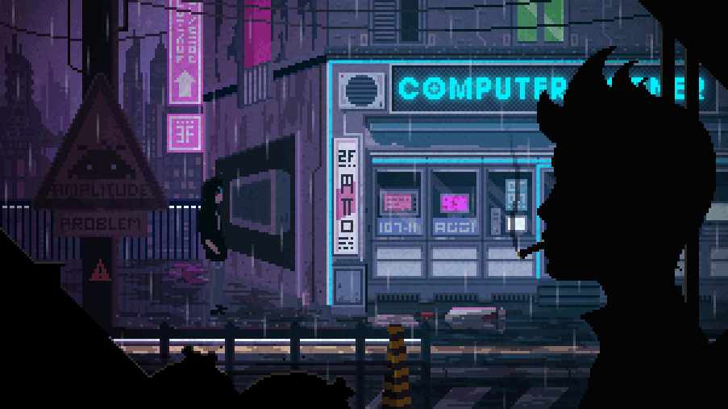

<!-- Top Banner GIF (Upload your own in assets/ folder or use a hosted .gif link) -->

  

<h1 align="center">Hi 👋, I'm Hasnain</h1>
<h3 align="center">🚀 FullStack Developer AI/ML Enthusiast</h3>

---

## 👨‍💻 About Me  
- 👋 Hi, I’m **Hasnain**, a FullStack Developer & AI/ML enthusiast from Pakistan.  
- 💻 Skilled in **Flutter, Dart, and modern backend technologies**.  
- 🧠 Focused on **Machine Learning, Deep Learning, and AI research**.  
- 📊 Experienced with **Python, TensorFlow, PyTorch, and Scikit-learn**.  
- 🚀 Passionate about building **scalable, intelligent applications**.  
- 🌱 Currently expanding my expertise in **backend development**.  
- 📫 Reach out: **hasnain.edu1@gmail.com**  

---

## 🌐 Connect with Me  

  
  
  
  

---

## 🧠 Languages, Tools & AI/ML Stack  

  
  
  
  
  
  
  
  
  
  
  
  
  

---

## 📊 GitHub Stats  

  
  

  

---

## 🐍 Contribution Graph  
<!-- If it doesn't show, run the Action once, confirm "output" branch, and add ?v=2 to bust cache -->

  <picture>
    <source media="(prefers-color-scheme: dark)" srcset="https://raw.githubusercontent.com/HasnainMARS/HasnainMARS/output/github-contribution-grid-snake-dark.svg?v=2" />
    
  </picture>

